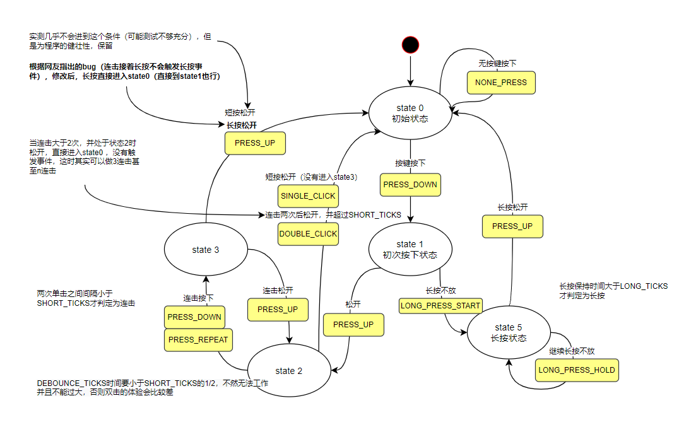

# MultiButton

## 简介
MultiButton 是一个小巧简单易用的事件驱动型按键驱动模块，可无限量扩展按键，按键事件的回调异步处理方式可以简化你的程序结构，去除冗余的按键处理硬编码，让你的按键业务逻辑更清晰。

MultiButton的作者是0x1abin, github地址: https://github.com/0x1abin/MultiButton. 

## 使用方法
1.先申请一个按键结构

```c
struct Button button1;
```
2.初始化按键对象，绑定按键的GPIO电平读取接口**read_button_pin()** ，后一个参数设置有效触发电平

```c
button_init(&button1, read_button_pin, 0);
```
3.注册按键事件

```c
button_attach(&button1, SINGLE_CLICK, Callback_SINGLE_CLICK_Handler);
button_attach(&button1, DOUBLE_CLICK, Callback_DOUBLE_Click_Handler);
...
```
4.启动按键

```c
button_start(&button1);
```
5.设置一个5ms间隔的定时器循环调用后台处理函数

```c
while(1) {
    ...
    if(timer_ticks == 5) {
        timer_ticks = 0;
        
        button_ticks();
    }
}
```

## 特性

MultiButton 使用C语言实现，基于面向对象方式设计思路，每个按键对象单独用一份数据结构管理：

```c
struct Button {
	uint16_t ticks;
	uint8_t  repeat: 4;
	uint8_t  event : 4;
	uint8_t  state : 3;
	uint8_t  debounce_cnt : 3; 
	uint8_t  active_level : 1;
	uint8_t  button_level : 1;
	uint8_t  (*hal_button_Level)(void);
	BtnCallback  cb[number_of_event];
	struct Button* next;
};
```
这样每个按键使用单向链表相连，依次进入 button_handler(struct Button* handle) 状态机处理，所以每个按键的状态彼此独立。


## 按键事件

事件 | 说明
---|---
PRESS_DOWN | 按键按下，每次按下都触发
PRESS_UP | 按键弹起，每次松开都触发
PRESS_REPEAT | 重复按下触发，变量repeat计数连击次数
SINGLE_CLICK | 单击按键事件
DOUBLE_CLICK | 双击按键事件
LONG_PRESS_START | 达到长按时间阈值时触发一次
LONG_PRESS_HOLD | 长按期间一直触发


## Examples

```c
#include "button.h"

struct Button btn1;

uint8_t read_button1_GPIO() 
{
	return HAL_GPIO_ReadPin(B1_GPIO_Port, B1_Pin);
}

void BTN1_PRESS_DOWN_Handler(void* btn)
{
	//do something...
}
void BTN1_PRESS_UP_Handler(void* btn)
{
	//do something...
}

int main()
{
	button_init(&btn1, read_button1_GPIO, 0);
	button_attach(&btn1, PRESS_DOWN,       BTN1_PRESS_DOWN_Handler);
	button_attach(&btn1, PRESS_UP,         BTN1_PRESS_UP_Handler);
	button_attach(&btn1, PRESS_REPEAT,     BTN1_PRESS_REPEAT_Handler);
	button_attach(&btn1, SINGLE_CLICK,     BTN1_SINGLE_Click_Handler);
	button_attach(&btn1, DOUBLE_CLICK,     BTN1_DOUBLE_Click_Handler);
	button_attach(&btn1, LONG_PRESS_START, BTN1_LONG_PRESS_START_Handler);
	button_attach(&btn1, LONG_PRESS_HOLD,  BTN1_LONG_PRESS_HOLD_Handler);
	button_start(&btn1);
	
	//make the timer invoking the button_ticks() interval 5ms.
	//This function is implemented by yourself.
	__timer_start(button_ticks, 0, 5); 
	
	while(1) 
	{}
}

```

## 状态图


